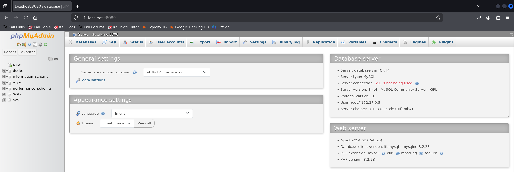
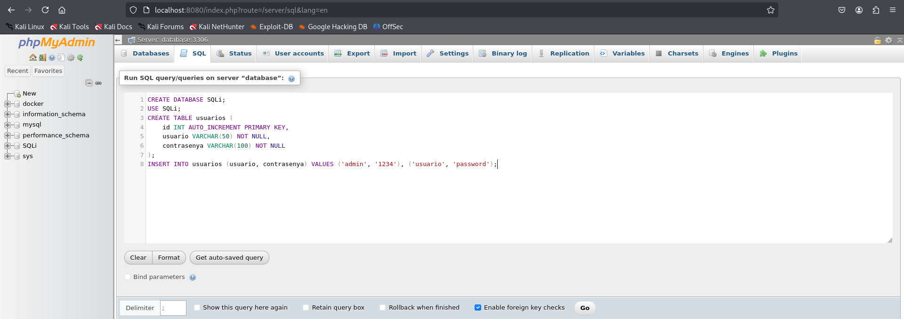
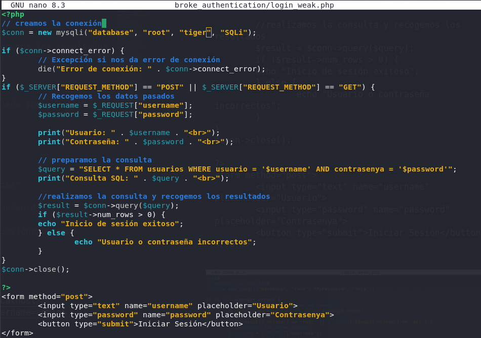
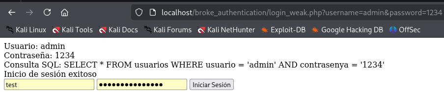
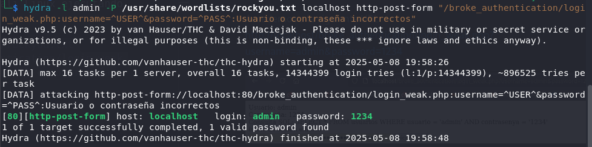
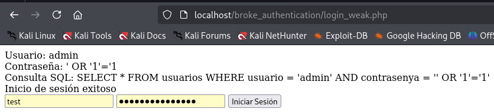
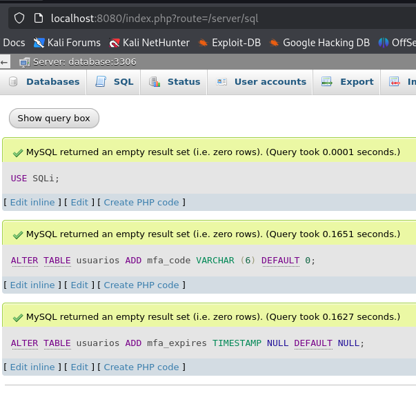
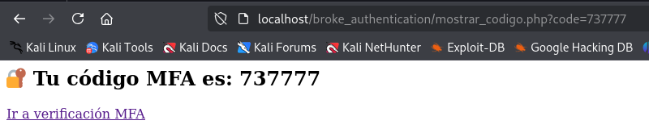
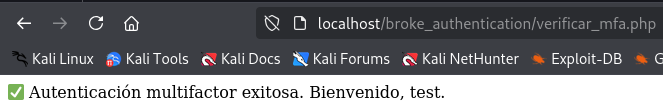

# PPS-Unidad3Actividad12-AdrianCurtoSanchez

## Creación de la Base de Datos

Acedemos a php myadmin a través de la URL http://localhost:8080/.


Accedemos a la pestaña SQL donde introducimos la siguiente sentecia SQL para crear la base de datos que contendra las credenciales de acceso:
```
CREATE DATABASE SQLi;
USE SQLi;
CREATE TABLE usuarios (
	id INT AUTO_INCREMENT PRIMARY KEY,
	usuario VARCHAR(50) NOT NULL,
	contrasenya VARCHAR(100) NOT NULL
);
INSERT INTO usuarios (usuario, contrasenya) VALUES ('admin', '1234'), ('usuario', 'password');
```




## Código vulnerable

Creamos el archivo login_weak.php con el siguiente contenido:
```
<?php
// creamos la conexión 
$conn = new mysqli("database", "root", "tiger", "SQLi");

if ($conn->connect_error) {
        // Excepción si nos da error de conexión
        die("Error de conexión: " . $conn->connect_error);
}
if ($_SERVER["REQUEST_METHOD"] == "POST" || $_SERVER["REQUEST_METHOD"] == "GET") {
        // Recogemos los datos pasados
        $username = $_REQUEST["username"];
        $password = $_REQUEST["password"];

        print("Usuario: " . $username . "<br>");
        print("Contraseña: " . $password . "<br>");

        // preparamos la consulta
        $query = "SELECT * FROM usuarios WHERE usuario = '$username' AND contrasenya = '$password'";
        print("Consulta SQL: " . $query . "<br>");

        //realizamos la consulta y recogemos los resultados
        $result = $conn->query($query);
        if ($result->num_rows > 0) {
        echo "Inicio de sesión exitoso";
        } else {
                echo "Usuario o contraseña incorrectos";
        }
}
$conn->close();

?>
<form method="post">
        <input type="text" name="username" placeholder="Usuario">
        <input type="password" name="password" placeholder="Contrasenya">
        <button type="submit">Iniciar Sesión</button>
</form>
```



Accedemos a la siguiente URL http://localhost/broke_authentication/login_weak.php?username=admin&password=1234



## Explotación de vulnerabilidades de Autenticación Débil

### Ataque de fuerza bruta con Hydra

Realizamos un ataque con Hydra desde Kali Linux ejecutando el siguiente comando:
```
hydra -l admin -P /usr/share/wordlists/rockyou.txt localhost http-post-form "/broke_authentication/login_weak.php:username=^USER^&password=^PASS^:Usuario o contraseña incorrectos"
```


Vemos en verde las credenciales que ha encontrado.

## Explotación de SQL Injection

Al introducir las credenciales:
```
usuario: admin
contraseña: ' OR '1'='1
```

Vemos que obtenemos las credenciales.




## Mitigación: Código Seguro en PHP

### Uso de contraseñas cifradas con password_hash

Accedemos al contendedor de la base de datos con el siguiente comando:
```
docker exec -it lamp-mysql8 /bin/bash
```

Conectamos con la base de datos con el siguiente comando:
```
mysql -u root -p
```

Y ejecutamos la siguiente sentencia SQL para modificar el campo `contrasenya` de la tabla `usuarios`:
```
USE SQLi;
ALTER TABLE usuarios MODIFY contrasenya VARCHAR(255) NOT NULL; 
```

Creamos el fichero `add_user.php` con el siguiente código:
```
<?php
error_reporting(E_ALL);
ini_set('display_errors', 1);

// Conexión
$conn = new mysqli("database", "root", "tiger", "SQLi"); 
// ← Usa "localhost" si no estás en Docker
if ($conn->connect_error) {
    die("Conexión fallida: " . $conn->connect_error);
}

if ($_SERVER["REQUEST_METHOD"] == "POST") {
    // Verificamos campos
    if (isset($_POST["username"]) && isset($_POST["password"])) {
        $username = $_POST["username"];
        $password = $_POST["password"];

        // Hasheamos contraseña
        $hashed_password = password_hash($password, PASSWORD_DEFAULT);

        // Insertamos usuario
        $stmt = $conn->prepare("INSERT INTO usuarios (usuario, contrasenya) VALUES (?, ?)");
        if ($stmt === false) {
            die("Error en prepare: " . $conn->error);
        }

        $stmt->bind_param("ss", $username, $hashed_password);

        if ($stmt->execute()) {
            echo "✅ Usuario insertado correctamente.";
        } else {
            echo "❌ Error al insertar usuario: " . $stmt->error;
        }

        $stmt->close();
    } else {
        echo "⚠️ Por favor, rellena todos los campos.";
    }
}

$conn->close();
?>

<form method="post">
    <input type="text" name="username" placeholder="Usuario" required>
    <input type="password" name="password" placeholder="Contrasenya" required>
    <button type="submit">Crear Usuario</button>
</form>
```

Si accedemos a la URL http://localhost/broke_authentication/add_user.php crearemos un nuevo usuario en la base de datos con la contraseña hasheada.


Podemos comprobarlo desde phpmyadmin en http://localhost:8080.


Creamos el fichero `login_weak1.php` con el código:
```
<?php
// creamos la conexión 
$conn = new mysqli("database", "root", "MyPassword", "SQLi");

if ($conn->connect_error) {
        // Excepción si nos da error de conexión
        die("Error de conexión: " . $conn->connect_error);
}
if ($_SERVER["REQUEST_METHOD"] == "POST" || $_SERVER["REQUEST_METHOD"] == "GET") {
        // Recogemos los datos pasados
        $username = $_REQUEST["username"];
        $password = $_REQUEST["password"];

        print("Usuario: " . $username . "<br>");
        print("Contraseña: " . $password . "<br>");

        // NO PREVENIMOS SQL INJECTION, SOLO SE AGREGA PASSWORD_HASH
        $query = "SELECT contrasenya FROM usuarios WHERE usuario = '$username'";
        print("Consulta SQL: " . $query . "<br>");

        //realizamos la consulta y recogemos los resultados
        $result = $conn->query($query);
        if ($result->num_rows > 0) {
                $row = $result->fetch_assoc();
                $hashed_password = $row["contrasenya"];
                // Verificación de contraseña hasheada
                if (password_verify($password, $hashed_password)) {
                        echo "Inicio de sesión exitoso";
                } else {
                        echo "Usuario o contraseña incorrectos";
                }
        } else {
                echo "Usuario no encontrado";
        }
}
$conn->close();

?>
<form method="post">
        <input type="text" name="username" placeholder="Usuario">
        <input type="password" name="password" placeholder="Contrasenya">
        <button type="submit">Iniciar Sesión</button>
</form>
```

Obtenemos un login exitoso:

Si introducimos datos no correcto dará el mensaje de "Usuario o contraseña no correctos"

## Uso de consultas preparadas

Creamos el fichero `login_weak2.php` con el siguiente código:
```
<?php
// Conexión
$conn = new mysqli("database", "root", "MyPassword", "SQLi");
if ($conn->connect_error) {
    die("Error de conexión: " . $conn->connect_error);
}

// Procesamos petición POST o GET
if ($_SERVER["REQUEST_METHOD"] == "POST" || $_SERVER["REQUEST_METHOD"] == "GET") {
    $username = $_REQUEST["username"];
    $password = $_REQUEST["password"];

    print("Usuario: " . $username . "<br>");
    print("Contraseña: " . $password . "<br>");

    // Consulta segura con prepare + bind
    $query = "SELECT contrasenya FROM usuarios WHERE usuario = ?";
    $stmt = $conn->prepare($query);
    $stmt->bind_param("s", $username);
    $stmt->execute();
    $stmt->store_result();

    print("Consulta SQL (preparada): " . $query . "<br>");

    if ($stmt->num_rows > 0) {
        $stmt->bind_result($hashed_password);
        $stmt->fetch();

        // Comprobamos si la contraseña ingresada coincide con el hash
        if (password_verify($password, $hashed_password)) {
            echo "✅ Inicio de sesión exitoso";
        } else {
            echo "❌ Usuario o contraseña incorrectos";
        }
    } else {
        echo "❌ Usuario no encontrado";
    }

    $stmt->close();
}
$conn->close();
?>

<!-- Formulario -->
<form method="post">
    <input type="text" name="username" placeholder="Usuario">
    <input type="password" name="password" placeholder="Contrasenya">
    <button type="submit">Iniciar Sesión</button>
</form>
```

Debemos editar la tabla usuarios para que almacene el campo `failed_attempts` y `last_attempt` para almacenar el número de intentos y la fecha de último intento de inicio de sesión:
```
USE SQLi;
ALTER TABLE usuarios ADD failed_attempts INT DEFAULT 0;
ALTER TABLE usuarios ADD last_attempt TIMESTAMP NULL DEFAULT NULL;
```

## Implementar autenticación multifactor (MFA)

### 1. Modificación en la Base de Datos

En la base de datos ejecutamos el siguiente código SQL:

```
USE SQLi;
ALTER TABLE usuarios ADD mfa_code VARCHAR (6) DEFAULT 0;
ALTER TABLE usuarios ADD mfa_expires TIMESTAMP NULL DEFAULT NULL;
```



### 2. login_weak4.php (login + generación del código)

Crea el archivo `login_weak4.php` con el siguiente contenido (recuerda cambiar la contraseña):

```
<?php
$conn = new mysqli("database", "root", "MyPassword", "SQLi");
if ($conn->connect_error) {
    die("Error de conexión: " . $conn->connect_error);
}

session_start();

if ($_SERVER["REQUEST_METHOD"] == "POST") {
    $username = $_POST["username"];
    $password = $_POST["password"];

    $query = "SELECT contrasenya FROM usuarios WHERE usuario = ?";
    $stmt = $conn->prepare($query);
    $stmt->bind_param("s", $username);
    $stmt->execute();
    $stmt->store_result();

    if ($stmt->num_rows > 0) {
        $stmt->bind_result($hashed_password);
        $stmt->fetch();

        if (password_verify($password, $hashed_password)) {
            // ✅ Login correcto - generar MFA
            $mfa_code = strval(rand(100000, 999999));
            $expires = (new DateTime('+5 minutes'))->format('Y-m-d H:i:s');

            // Guardar código MFA
            $update = $conn->prepare("UPDATE usuarios SET mfa_code = ?, mfa_expires = ? WHERE usuario = ?");
            $update->bind_param("sss", $mfa_code, $expires, $username);
            $update->execute();

            // Guardar usuario en sesión para MFA
            $_SESSION["mfa_user"] = $username;

            // Redirigir a mostrar el código y luego a verificación
            header("Location: mostrar_codigo.php?code=$mfa_code");
            exit();
        } else {
            echo "❌ Contraseña incorrecta.";
        }
    } else {
        echo "❌ Usuario no encontrado.";
    }
    $stmt->close();
}
$conn->close();
?>

<form method="post">
    <input type="text" name="username" placeholder="Usuario" required>
    <input type="password" name="password" placeholder="Contraseña" required>
    <button type="submit">Iniciar sesión</button>
</form>

```

### 3. mostrar_codigo.php

Creamos el archivo `mostrar_codigo.php` con el que visualizaremos el código enviado. Esto simula el ver el código en el email.

```
<?php
$code = $_GET["code"] ?? "XXXXXX";
echo "<h2>🔐 Tu código MFA es: <strong>$code</strong></h2>";
echo "<a href='verificar_mfa.php'>Ir a verificación MFA</a>";
?>
```

### 4. verificar_mfa.php (verificación del código)ç

Creamos el archivo `verificar_mfa.php` que nos indicará si el código introducido es correcto (recuerda cambiar la contraseña).

```
<?php
session_start();
$conn = new mysqli("database", "root", "tiger", "SQLi");
if ($conn->connect_error) {
    die("Error de conexión: " . $conn->connect_error);
}

if (!isset($_SESSION["mfa_user"])) {
    die("⚠️ No hay sesión activa para MFA.");
}

$username = $_SESSION["mfa_user"];

if ($_SERVER["REQUEST_METHOD"] == "POST") {
    $code_input = $_POST["mfa_code"];

    $query = "SELECT mfa_code, mfa_expires FROM usuarios WHERE usuario = ?";
    $stmt = $conn->prepare($query);
    $stmt->bind_param("s", $username);
    $stmt->execute();
    $stmt->bind_result($mfa_code, $mfa_expires);
    $stmt->fetch();

    $now = new DateTime();
    $expires_time = new DateTime($mfa_expires);

    if ($code_input == $mfa_code && $now < $expires_time) {
        echo "✅ Autenticación multifactor exitosa. Bienvenido, $username.";

        // Limpieza del código MFA
        $clear = $conn->prepare("UPDATE usuarios SET mfa_code = NULL, mfa_expires = NULL WHERE usuario = ?");
        $clear->bind_param("s", $username);
        $clear->execute();

        session_destroy(); // o puedes mantener sesión como autenticado
    } else {
        echo "❌ Código incorrecto o expirado.";
    }
    $stmt->close();
}
$conn->close();
?>

<form method="post">
    <input type="text" name="mfa_code" placeholder="Código MFA" required>
    <button type="submit">Verificar Código</button>
</form>

```

### Prueba

Accedemos a la URL http://localhost/broke_authentication/login_weak4.php e introducimos las credenciales del usuario con la contraseña hasheada.

Copiamos el código que nos genera y pinchamos en el enlace de verificación.



Si el código es correcto nos indicará que la operación es correcta.

 
